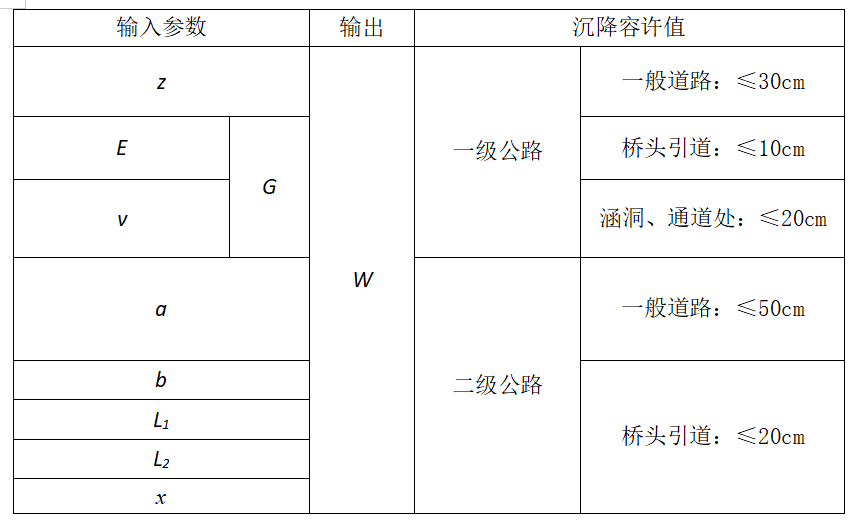
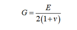

**报告输出样式：**

\----------------------------------------------------------------------

[ 项目名称 ]

\----------------------------------------------------------------------

\*\*\*\*\*\*\*

\----------------------------------------------------------------------

[ 项目类型 ]

\----------------------------------------------------------------------

**\*5种选择其中1种，容许值在计算过程中参考\***

\----------------------------------------------------------------------

[ 计算条件 ]

\----------------------------------------------------------------------

[ 新建公路 ]

公路类型：一级公路/二级公路

车道数量：

桩顶荷载P： （KN）

[ 土层参数 ]

沉降计算修正公式：

**\*压缩模量 E与泊松比 v 后期会根据计算要求调整为固定数值或者灵活输入\***

序号 土类型 土层厚 压缩模量 *E* 泊松比 *v*

1

2

3

4

[ 桩1参数 ]

桩直径： (m)

桩长： (m)

[ 桩2参数 ]

桩直径： (m)

桩长： (m)

[ 被跨越公路参数 ]

路基宽度： (m)

路基与桩1距离： (m)

路基与桩2距离： (m)

\----------------------------------------------------------------------

计算结果:

\----------------------------------------------------------------------

沉降计算点坐标(X0,Y0) = (0.0,0.0) 点沉降量（桩1） 点沉降量（桩2） 总沉降量

..........

..........

..........

沉降计算点坐标(Xn,Yn) = (n.n,n.n) 点沉降量（桩1） 点沉降量（桩2） 总沉降量

**路基下的计算点**总沉降量最大值：xxxx(mm) →（与对应公路等级沉降容许值对比）

**\*后面可以接软件中桩基沉降影响评估报告的内容\***

\----------------------------------------------------------------------

计算简图:

\----------------------------------------------------------------------
