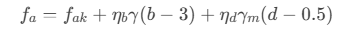
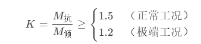

### **电线跨越塔基础稳定性计算**

#### **一、计算依据**

**GB 50007-2011**《建筑地基基础设计规范》

**GB 50545-2010**《110kV\~750kV架空输电线路设计规范》

**DL/T 5219-2014**《架空输电线路基础设计技术规程》

#### **二、基本参数**

电线塔基础稳定性计算是确保输电线路安全的核心环节，需综合校验**地基承载力**、**抗倾覆**、**抗滑移**和**抗拔稳定性**。以下是计算方法和工程实践要点：

| 输入参数                                         |   |
|--------------------------------------------------|---|
| *γ*：土体重度（kN/m³，一般取18\~20）             |   |
| *γm*：土体平均重度（kN/m³，一般取18\~20）        |   |
| *N*：铁塔压力（kN）                              |   |
| *G*：基础重力（kN）                              |   |
| b：基础宽度（m）                                 |   |
| *l*：基础长度（m）                               |   |
| *d*：基础埋深（m）                               |   |
| *fak*​：地勘报告提供的承载力标准值（kPa）         |   |
| *ηb*​,*ηd*​：宽度和深度修正系数（GB 50007表5.2.4） |   |
| *Fw*：水平力（风荷载+导线张力水平分量）（kN）    |   |
| *h*：水平力作用点中心位置（m）                   |   |
| *μ*：基底摩擦系数（岩石取0.6，黏土取0.3）        |   |

#### **三、计算结果**

##### **1. 地基承载力验算**

**（1）基底压力计算（需同时满足以下条件，否则标记为红色字体）**

*N*：塔腿轴向压力（标准值）

*G*：基础自重（含覆土）

*A*：基底面积（*A*=*b*×*l*）

*W*：截面抵抗矩（）

*fa*​：修正后的地基承载力特征值

**（2）地基承载力修正**

*fak*​：地勘报告提供的承载力标准值

*ηb*​,*ηd*​：宽度和深度修正系数（GB 50007表5.2.4）

*γ*：基底以下土重度

*γm*​：基底以上加权平均重度

##### **2. 抗倾覆验算（需同时满足以下条件，否则标记为红色字体）**

**（1）倾覆力矩M倾​**

**M倾​**=*Fw·h*

*Fw*：水平力（风荷载+导线张力水平分量）

*h*：水平力作用点中心位置

**（2）抗倾覆力矩M抗​**

1.  

*b*：基础底面宽度（抵抗倾覆方向）

##### **3. 抗滑移验算（需同时满足以下条件，否则标记为红色字体）**

*μ*：基底摩擦系数（岩石取0.6，黏土取0.3）
