1、图中红色方框处加上“安全评估报告”内容

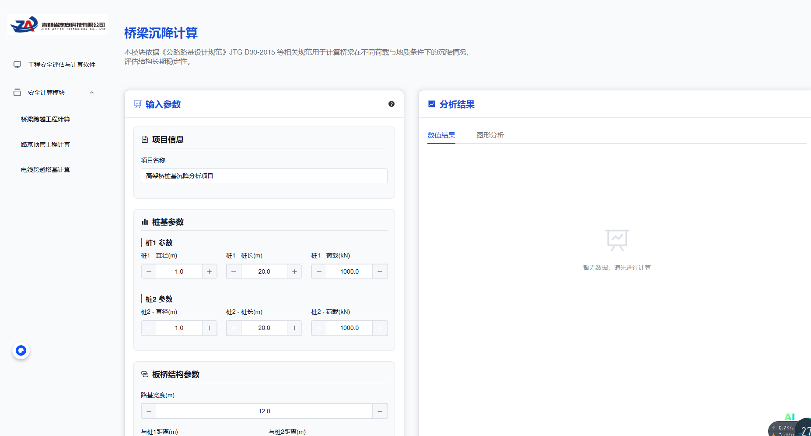桥梁沉降计算的分析结果的图形分析右边加上逻辑同一个层级的“安全评估报告”内容

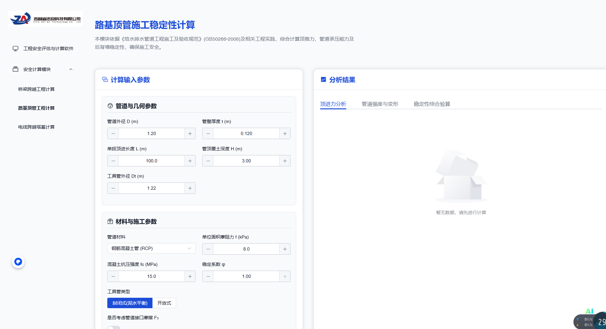路基顶管施工稳定性计算的分析结果的稳定性综合验算右边加上逻辑同一个层级的“安全评估报告”内容

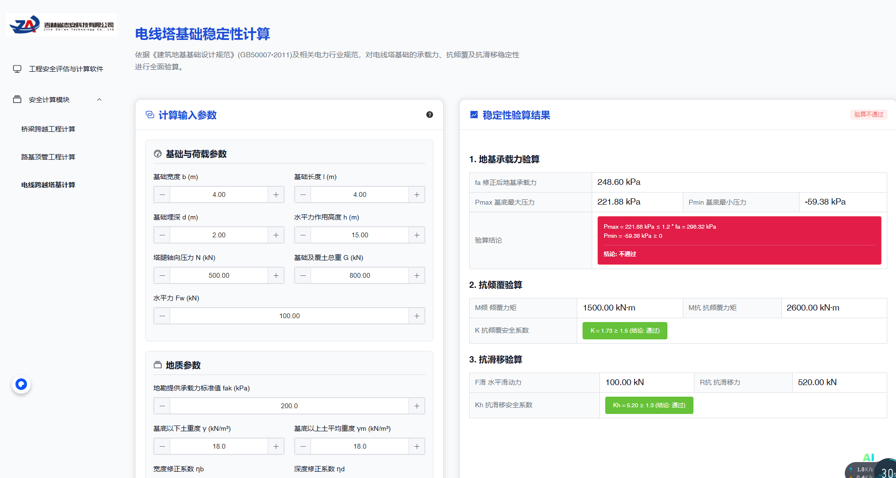

2、路基顶管工程计算加入图片如下图所示，环向应力与管体变形量验算同时满足要求则图中管体阴影部分为绿色，反之为红色。

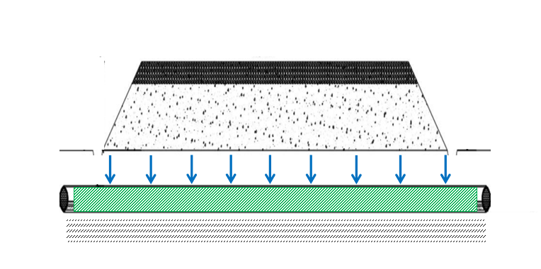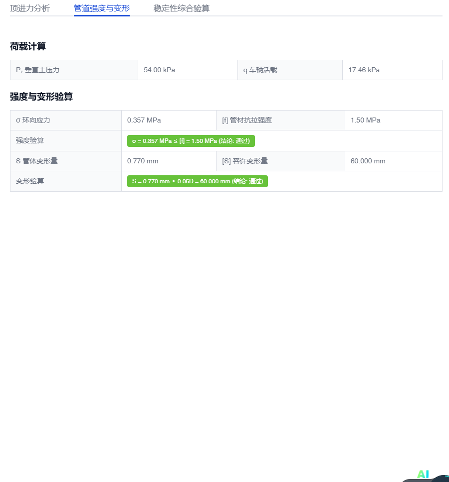
程序代码内部内采用没有阴影的原图：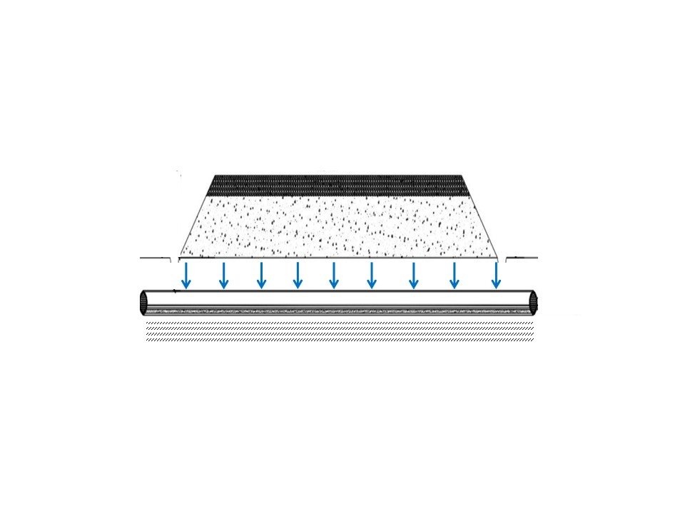
请你在这个原图的基础上，把管体与后背墙的阴影部分加上，环向应力与管体变形量验算同时满足要求则图中管体阴影部分为绿色，反之为红色。
3、路基顶管工程计算加入图片如下图所示，管体承压能力与后背墙抗滑移验算满足要求则图中管体与后背墙阴影部分为绿色，反之为红色。

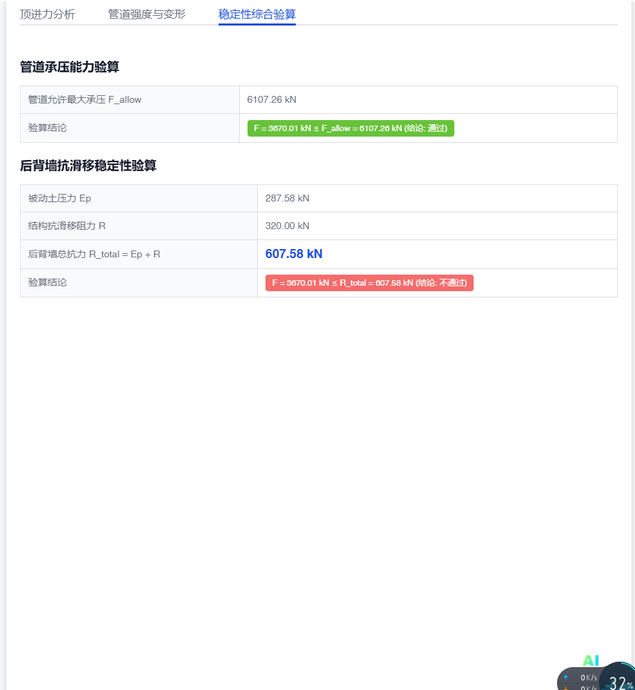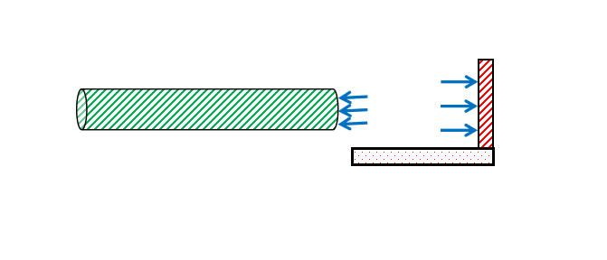
程序代码内部内采用没有阴影的原图：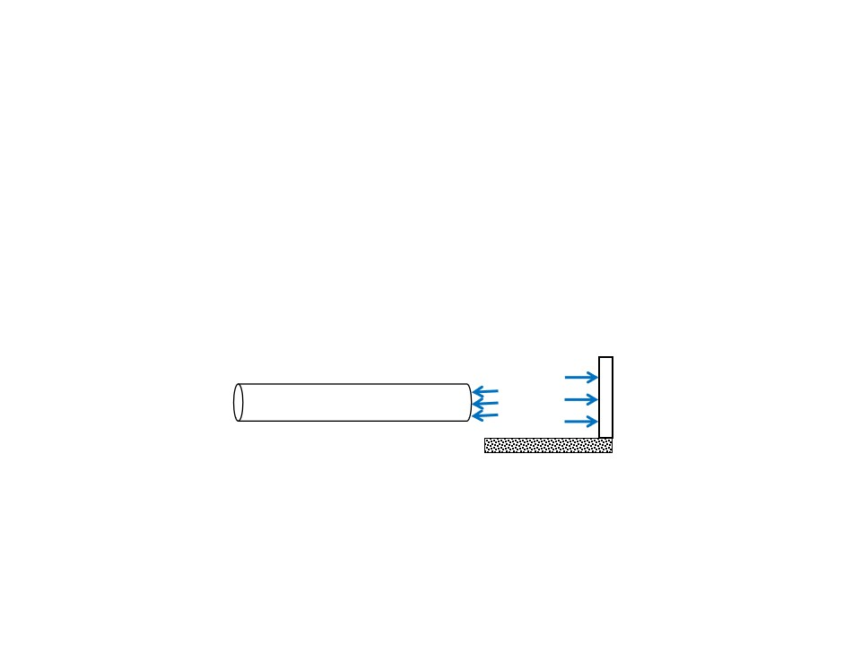
请你在这个原图的基础上，把管体与后背墙的阴影部分加上，管体承压能力与后背墙抗滑移验算满足要求则图中管体与后背墙阴影部分为绿色，反之为红色。
1.  电线塔基础稳定性计算在计算输入参数下方加入塔体自重计算内容如下表，位置如下图所示。

内容：

| 材料类别 | 延米长度 （m） | 横截面积 （m2） | 密度 （kg/m3） | 总质量 （kg） |
|----------|----------------|-----------------|----------------|---------------|
| 1        |                |                 |                |               |
| 2        |                |                 |                |               |
| ...      |                |                 |                |               |
| 10       |                |                 |                |               |
| 合计     |                |                 |                |               |

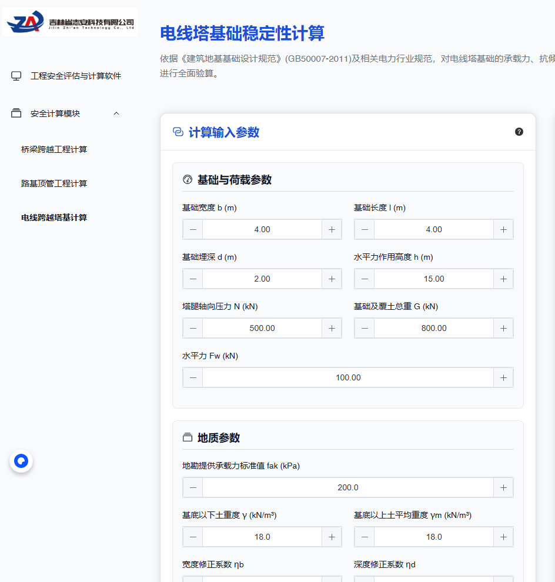

1.  电线塔基础稳定性计算加入图片，地基承载力、抗倾覆与抗滑移验算同时满足要求则图中基础阴影部分为绿色，反之为红色。。

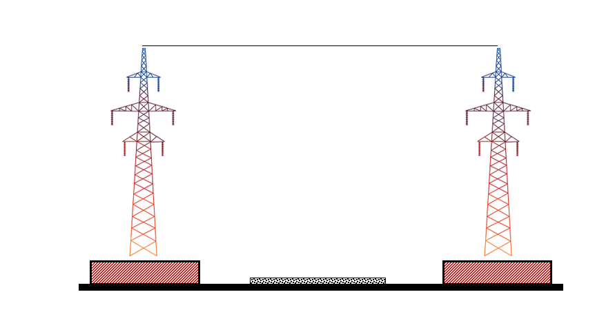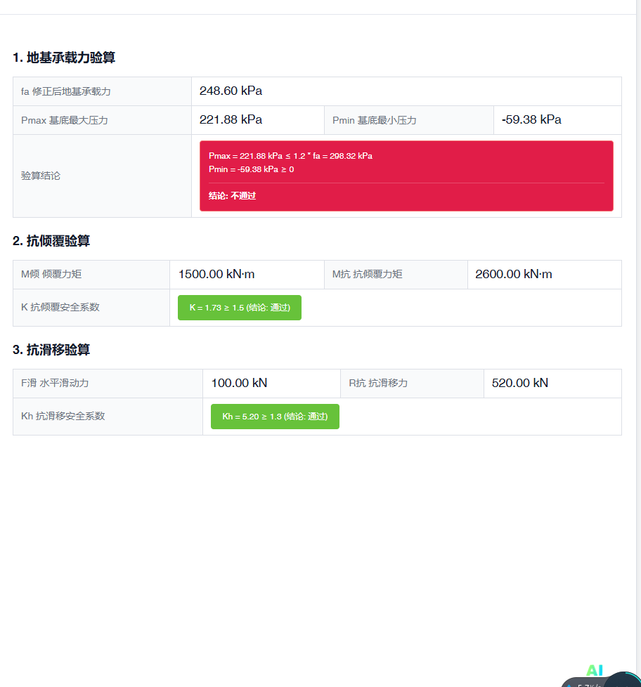
程序代码内部内采用没有阴影的原图：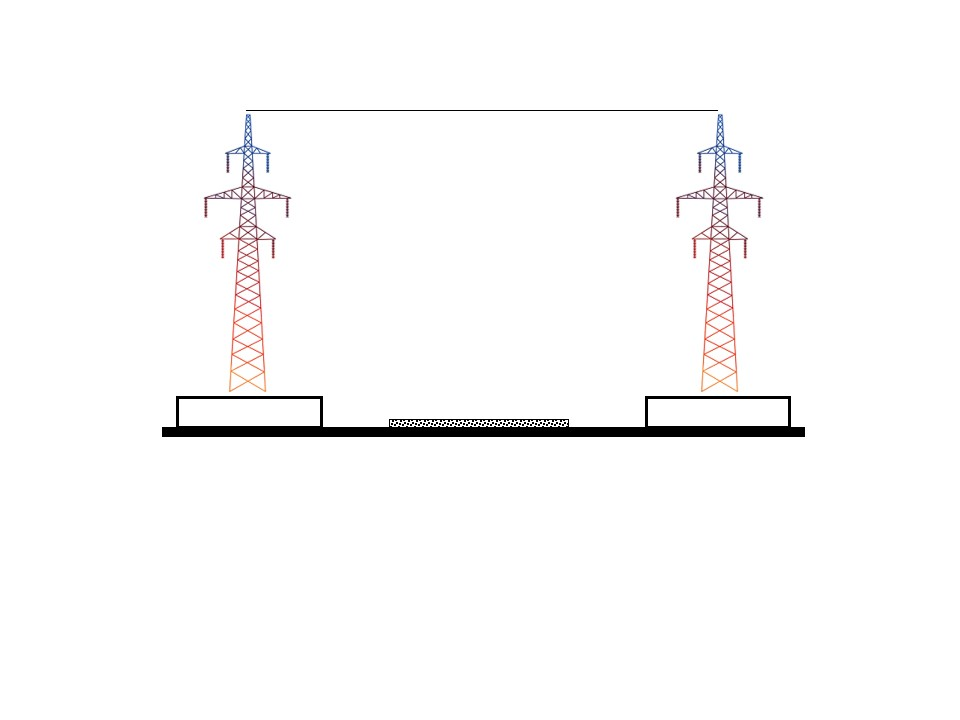
请你在这个原图的基础上，把基础与地面的阴影部分加上，地基承载力、抗倾覆与抗滑移验算满足要求则图中基础与地面阴影部分为绿色，反之为红色。