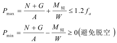

# 路基顶管计算

## 一、顶推力计算内容

路基顶管施工中，顶推力验算是确保顶管机和工作井后背墙能够安全克服管道推进阻力的关键计算。验算需综合考虑土质条件、管道尺寸、顶进长度、润滑减阻措施等因素。以下是详细步骤和公式：

## 1.顶推力组成

顶推力需克服以下阻力：

管道外壁与土体的摩擦阻力（F） 工具管（机头）正面阻力（ $F_{2}$, 管道接口摩擦阻力（ $F_3$ ，若存在）

总顶推力设计值：

$$F=K\cdot(F_1+F_2+F_3)$$
$K$ ：安全系数，一般取1.1~1.5（根据地质和施工经验调整）。

## 2.分项阻力计算

(1）管道外壁摩擦阻力（F）

F=πDLf

$D_{c}$ ：管道外径（m）；

$L$ ：单段顶进长度（m）；

f：单位面积摩阻力（kPa），需根据土质和润滑条件确定： 无注浆润滑：黏性土取$5\sim15$ kPa ，砂性土取$10{\sim}20$ kPa 注浆减阻：可降至$2\sim8$ kPa （通过泥浆套降低摩擦）。

## (2）工具管正面阻力（ $F_2$

$$F_2=\frac{\pi D_t^2}{4}P$$

$D_{t}$ ：工具管外径（m）；

$P$ ：工具管前端土压力（kPa），分两种情况： 封闭式工具管（如泥水平衡）：取主动土压力$P=\gamma HK_{a}+2cK_{a}$

开放式工具管：取经验值$100{\sim}300$ kPa （或实测土压力）。其中：

y：土的重度$(kN/m^3$ ；

$H:$ ：管顶覆土深度（m）；

$K_a$ ：主动土压力系数（ $K_{a}=\tan^{2}(45^{\circ}-\phi/2))$ $c$ ：土的黏聚力（kPa）。

## (3）管道接口摩擦阻力（ $F_3$

若管道节段间存在接口摩擦（如钢承口），需额外计算： Fs=n·μN

$n$ ：接口数量：

$\mu$ ：摩擦系数（钢-混凝土取0.2~0.3）；

N：接口压紧力（kN）。

## 3.验算顶推力限制

顶推力需满足以下限制条件：

## （1）管道承压能力：

F<Φ-fAp

$f_{C*}$ 管道混凝土抗压强度设计值（MPa）；

$A_p$ ：管道最小净截面积（ $mm^2$ ）：

$\phi$ ：受压构件稳定系数（长细比低时可取1.0）。

### （2）工作井后背墙抗滑移稳定性：

$F\leq E_p+R$

$E_{p}$ ：被动土压力$(E_{p}=0.5\gamma H^{2}K_{p}+2cHK_{p})$ ：

$K_p$ ：被动土压力系数（ $(K_{p}=\tan^{2}(45^{\circ}+\phi/2))$

### （3）结构抗滑移阻力（R）

根据后背墙类型分别计算：

## $①$ 重力式混凝土后背墙

R=(W+Ws

W：后背墙自重（kN）；

$W_s$ ：墙后土体自重（kN）；

$\mu$ ：墙底与地基的摩擦系数（混凝土-土取0.3~0.5）。

# $②$ 桩基加固后背墙

R=n·Pu

n：抗滑桩数量；

$P_{u}$ ：单桩抗滑承载力（需根据桩长、土质计算或现场试验确定）。

# $③$ 钢板桩后背墙

$R{=}E_p$ tand+A

6：钢板桩与土体的摩擦角（取Φ/2~2/3）；

$A$ ：钢板桩与土体接触面积$(m^2$ ）：

$\tau$ ：界面抗剪强度（kPa）。

背墙结构抗力（如桩基、钢板桩提供的阻力）。

## 二、沉降计算内容

管道类型：一般采用钢筋混凝土管（RCP）、HDPE管或钢管，需满足《 GB50268-2008》要求。

埋深要求：管顶至路基底部距离$\geq0.6m$ （高速公路）或$\geq0.5m$ （一般道路） ，避免车辆动载破坏。

荷载标准：需考虑土压力、车辆活载（按《JTGD60-2015》公路桥涵设计规范取值）。

输入参数
γ：土体重度(kN/m³，一般取18-20)
H：管顶覆土高度(m)
D：管道外径(m)\ni：管壁厚度(m)
f：管材抗拉强度(混凝土管取1.5MPa，HDPE管取8MPa)

输出参数
P：垂直土压力(kPa)
q：车辆活载(kPa)
σ：环向应力(MPa)
S：管体变形量(mm)

E: 管材弹性模量（混凝土主管30GPa，HDPE管0.8GPa）
E': 土体反力模量（一般取10~30MPa）

# 1.土压力计算

### 垂直土压力

$$P_{_v}=\gamma\cdot H$$

y：土体重度（ $kN/m^3$ ，一般取18~20）

$H:$ 管顶覆土高度（m）

### 2.车辆活载计算

按《JTGD60-2015》等效均布荷载法：

$$q=\frac{260}{A}$$

$A$ ：荷载分布面积（ $m^2$ ），按$30^\circ$ 扩散角计算：

$$A=(0.2+2Htan30^\circ)\times(0.6+2Htan30^\circ)$$

### 3.管道强度验算

（1）环向压力（<f时显示为黑色字体，超限为红色

$$\sigma=\frac{\left(P_{\nu}+q\right)\cdot D}{2t}\leq f,$$

$D$ ：管道外径（m）

t：管壁厚度（m）

f：管材抗拉强度（混凝土管取1.5MPa，HDPE管取8MPa）

（2）变形验算（ $\leq0.05D$ 时显示为黑色字体，超限为红色)

$$S=\frac{\left(P_{\nu}+q\right)\cdot D^{4}}{3.67Et^{3}+0.061E^{\prime}D^{3}}\leq0.05D$$

$E$ ：管材弹性模量（混凝土管30GPa，HDPE管0.8GPa）

$E^{\prime}$ ：土体反力模量（一般取10~30MPa）

# 三、规范依据

GB50268-2008《给水排水管道工程施工及验收规范》

JTGD60-2015《公路桥涵设计通用规范》

GB/T11836-2009《混凝土和钢筋混凝土排水管》

### 电线塔基础稳定性计算

电线塔基础稳定性计算是确保输电线路安全的核心环节，需综合校验地基承载力、抗倾覆、抗滑移和抗拔稳定性。以下是计算方法和工程实践要点

输入参数 | 输出参数
---|---
γ: 土体重度(kN/m³), 一般取18-20 | fₜ: 修正后的地基承载力(kPa)
γ₀: 土体平均重度(kN/m³), 一般取18-20 | Pₘₐₓ₁: 基坑压力最大值(kPa)
N: 铁塔压力(kN) | Pₘᵢₙ₁: 基坑压力最小值(kPa)
G: 基础重力(kN) | K₁: 抗倾覆安全系数
b: 基础宽度(m) | K₂: 抗滑移安全系数
l: 基础长度(m) |
d: 基础埋深(m) |
fₜₐ: 地勘报告提供的承载力标准值(kPa) |
ηbd: 宽度和深度修正系数(GB50007表5.2.4) |
Fₑₜ: 水平力(风荷载+导线张力水平分量)(kN) |
h: 水平力作用点中心位置(m) |
μ: 基底摩擦系数(岩石0.6, 黏土0.3) |

### 二、基础稳定性计算内容

### 1.地基承载力验算

（1）基底压力计算（需同时满足以下条件，否则标记为红色字体

N：塔腿轴向压力（标准值）

$G$ ：基础自重（含覆土)

$A$ ：基底面积（ $\therefore A=b\times l$ W：截面抵抗矩（ $W=\frac{bl^2}6$ $f_{a}$ ：修正后的地基承载力特征值

## （2）地基承载力修正

$$f_a=f_{ak}+\eta_b\gamma(b-3)+\eta_d\gamma_m(d-0.5)$$

f：地勘报告提供的承载力标准值

nb,na:宽度和深度修正系数（GB50007表5.2.4）

y：基底以下土重度$\gamma^{r_m}$ ：基底以上加权平均重度

2.抗倾覆验算（需同时满足以下条件，否则标记为红色字体）

$$K=\frac{M_\text{抗}}{M_\text{倾}}\geq\begin{cases}1.5&\text{(正常工况)}\\1.2&\text{(极端工况)}\end{cases}$$

## （1）倾覆力矩$M_\text{倾}$

M例=Fwh

$F_{\nu^{\prime}}$ ：水平力（风荷载+导线张力水平分量）

h：水平力作用点中心位置

## （2）抗倾覆力矩$M_\text{扰}$

$$M_{\text{抗}}=\bigl(N+G\bigr)\cdot\frac{b}{2}$$

$b$ ：基础底面宽度（抵抗倾覆方向）

3.抗滑移验算（需同时满足以下条件，否则标记为红色字体)

$$K_{_h}=\frac{\left(N+G\right)\cdot\mu}{F_{_w}}\geq1.3$$

$\mu$ ：基底摩擦系数（岩石取0.6，黏土取0.3）

### 三、规范依据

GB50007-2011《建筑地基基础设计规范》

GB50545-2010《110kV~750kV架空输电线路设计规范》

DL/T5219-2014《架空输电线路基础设计技术规程》